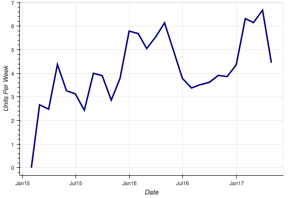
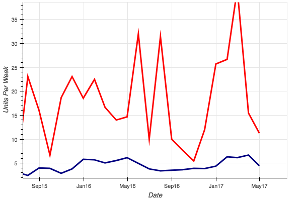
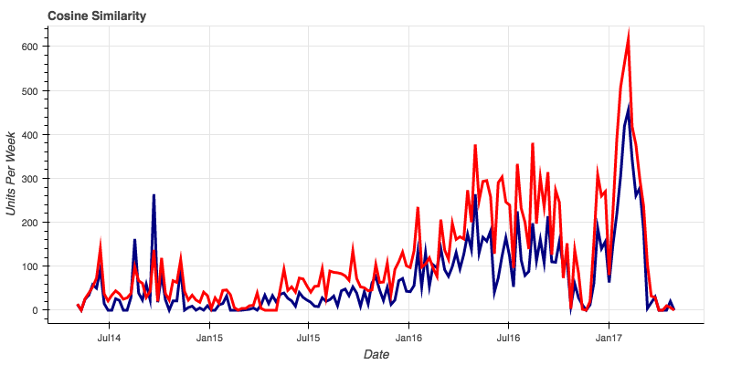
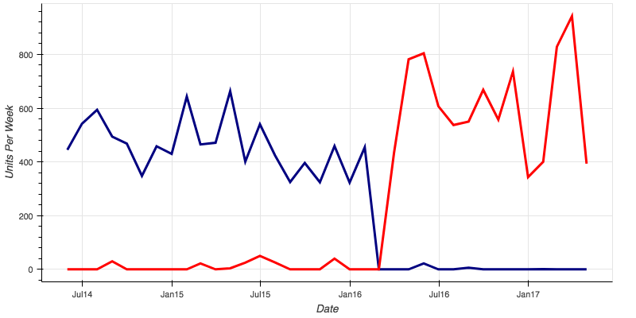

<h1>Time Series Analysis of Restaurant Supply Ordering

 ____

<h5> with special thanks to:

 <h2> Background:
<h5> 
 I was interested to learn about Time Series Analysis and modeling. I partnered with The Wasserstrom Company, a national restaurant supply company.  They deliver supplies for restaurants ranging from paper towels to stoves and dinning tables. They gave me access to three years of their order data for one of their distribution centers focusing on reorder items.  Those being items that are often reordered and take up a large amount of thier inventory space.  Given a background in restaurant management I have observed seasonal trends that I wished to farther investigate. 

 <h2>Objectives:
 <h5>
 Use time series and knowledge of the industry to find trends, seasonality, and movement in ordering to predict inventory requirements.

Identify customers that cause the greatest variance in inventory needs
 
Identify ways to model required inventory by week 

____
<h2>
The Data:
<h5>
1.5 Million order over three years broken down by order date, order customer, item, and quantity.  Order customers represent between 10 and 2000 locations.  These orders focused on 'reorder items' or items that will be regularly ordered (not one time orders like stoves). This included over 24,000 items.  

____
<h2> Analysis:
<h3>Looking For Trends:
<h5>
The expectation was to find seasonal trends for the data. Distinct patterns from year to year for products.  Figure 1.1 shows an item order history for one small client.

There is a increasing trend (overall orders increase) and a seasonality (there is a strong increase in orders around January).  This was the trending expected in the data.  However once the order data for other larger clients was also included into the data the variance increased. 

Figure 1.2 - The blue line is a flattened version of figure 1.1 and the red is the order history for all clients combined.  As you can see there does not seem to be any time related trends in this data. 

_____

<h2>
Analysis for Parameters for Modeling:
<h5>
To increase data for trend analysis and modeling I used cosine similarity and Hierarchical Clustering to find similar trends.  

Figure 1.3 - Two items found using cosine similarity. Can be used as prameters in modeling.

___
<h2>
Finding Changes in Product Use:
<h5>
With changes in product options and prices large clients often change what reorder items they use.  This leads to a cold start issue with predicting needed inventory.  However we can use the order history from the old product in our model to predict the usage for the new item.  

Figure 1.4 - Here is the change over from one product to another (porduct in red droped in price making it cheaper then the blue porduct).

______

<h2>Next Steps:
<h5>
I will need to deconstruct the large customer groups into regional deliveries and find trends to Model.  Each item will then need to be modeled in these smaller groups for prediction and create a bottom up aggregate model for each item to predict needed inventory to minimize inventory overhead.